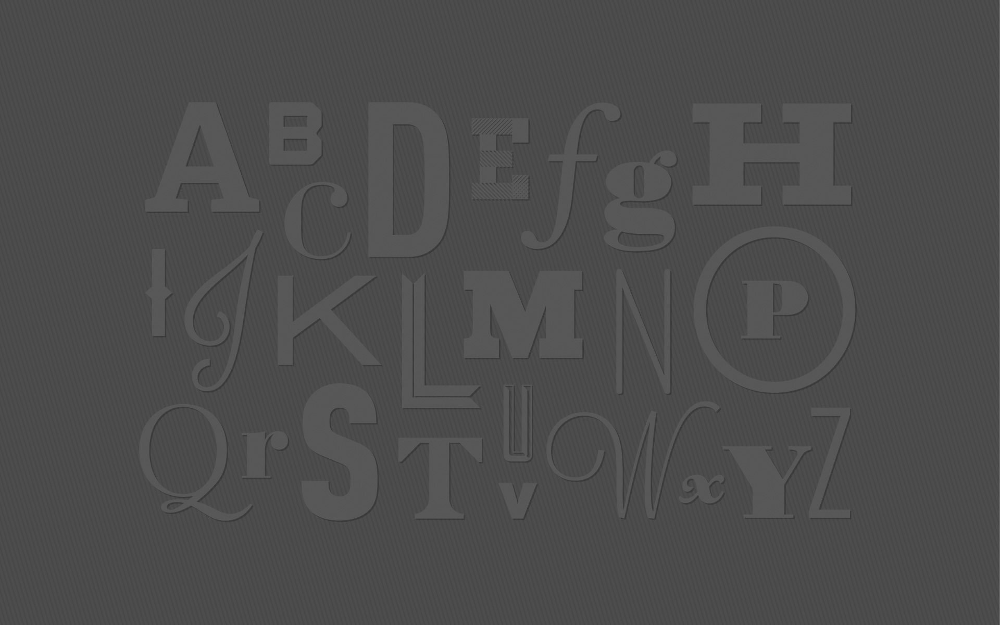

autoscale: true,
build-lists: true

## Web typography workshop 2

---

## Write on the stickies
### what do you hope to learn from the workshop?

^ review the answers

---

# Big Faces

 

^ intro selves
name, job, employer

---

## Agenda (sort of)

- Broad overview of fonts on the web

- Choosing and pairing fonts

- Units of measure

- Setting a typographic scale

- Basic CSS type properties: color, sizing, line-height, etc

- Advanced CSS type properties: Open Type Features

^
Won't cover these in order but discuss and deal with them as we do the practical exercise

---

## 1. What we will build

^ download repo etc

---

## 2. Typography an overview

^ Justin presentation

---

## 3. Let's go
### Write on the stickies

^ Using web page discuss basic CSS properties to use, e.g. font-size, color, etc.

---

## 4. Work work work

^ work on web page

---

## 5. font-feature settings

^ talk it through
show examples
Danielle

---

## One sentence summary:  what you've learned

---

## Finish!

^ finish web page

---

## What will you do with what you learned?

^ stickies

---

## Facilitator Feedback  
### Sticky notes 
### One thing we  could do differently

^ leave them on the table
